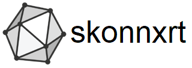

.. image:: https://dev.azure.com/xadupre/scikit-onnxruntime/_apis/build/status/xadupre.scikit.onnxruntime
    :target: https://dev.azure.com/xadupre/scikit-onnxruntime

Introduction
------------

*scikit-onnxruntime* wraps 
`onnxruntime <https://github.com/microsoft/onnxruntime>`_
with `scikit-learn <https://scikit-learn.org/stable/>`_ API.

Documentation
-------------

Full documentation including tutorials is available at
`xadupre.github.io <https://xadupre.github.io/>`_.

You may also find answers in 
`existing issues <https://github.com/xadupre/scikit-onnxruntime/issues?utf8=%E2%9C%93&q=is%3Aissue>`_
or submit a new one.

Installation
------------

You can install from `PyPi <https://pypi.org/project/scikit-onnxruntime>`_::

    pip install skonnxrt

Or you can install from the source with the latest changes::

    pip install git+https://github.com/xadupre/scikit-onnxruntime.git

Contribute
----------

We welcome contributions in the form of feedback, ideas, or code. 

License
-------

`MIT License <LICENSE>`_
